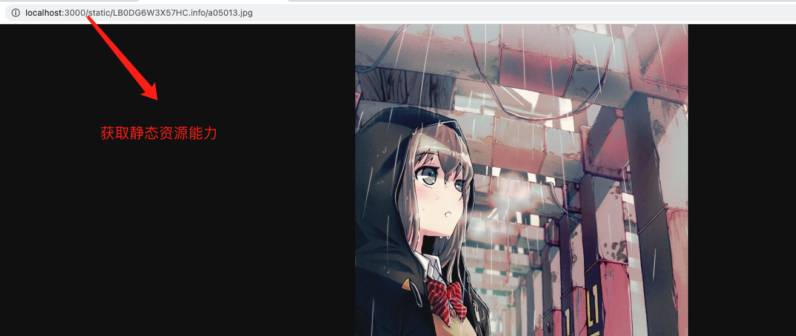

# EagleApi

让你的 eagle 拥有 api 查询能力，基于 json-server。

> 官方 API 依赖于客户端，无法直接在服务器中部署。

## 在线体验

- API - [json-server.rao.pics](https://json-server.rao.pics/images?_limit=20)
- WEB - [rao.pics](https://rao.pics)

## 介绍

如果你也想把 eagle 作为一个本地管理系统，每次修改文件，都能动态更新路由，你可以试试它。


**数据查询能力**


**读取静态资源**



**图片库中新增的文件**


## 安装

```sh
git clone https://github.com/meetqy/eagle-api
cd eagle-api
```

### 配置

将 .env.example 改为 .env

```shell
# eagle library地址 绝对路径
library_dir=xxx.library

# 端口号
port=3000
```

### 启动

```
npm i
npm run dev
```

## API 说明

### 自定义 filter

在 `json-server` 基础上，针对本项目新增的查询

| 参数    | 说明            | 用法                                  | 场景         |
| ------- | --------------- | ------------------------------------- | ------------ |
| `_null` | 字段是否为 null | `/images?tags_null&_page=1&_limit=20` | 未标签的图片 |

### images

```sh
# 获取全部图片信息，数据量过大可能卡顿
/images

# 按key获取
/images?height=1920

# 分页
/images?_page=1&_limit=20

# key获取 + 分页
/images?height=1920&_page=1&_limit=20
```

> 更多查询功能可查看 [json-server#routes](https://github.com/typicode/json-server#routes)

### 其他

```sh
# 获取修改的图片信息 以天为单位
/change

# 获取添加的图片信息 一天为单位
/add

# 获取metadata
/metadata

# 获取标签信息
/tags

# 获取静态资源
/static/filename.info/filename.jpg
# eg: /static/LB0DG6W3X57HC.info/a05013.jpg
```

## 待实现功能

- [x] 关联本地静态文件，可访问图片

## 奇淫技巧

利用腾讯对象存储官方工具，自动同步图片库，在用 json-server 托管远程文件轻松实现将 eagle 在线化。


> 难点：json-server 远程不支持监听文件改动，暂无解决方案，如果有想法的小伙伴欢迎一起沟通

## 链接

- [Eagle](https://cn.eagle.cool/)
- [官方创建 API](https://api.eagle.cool/)
