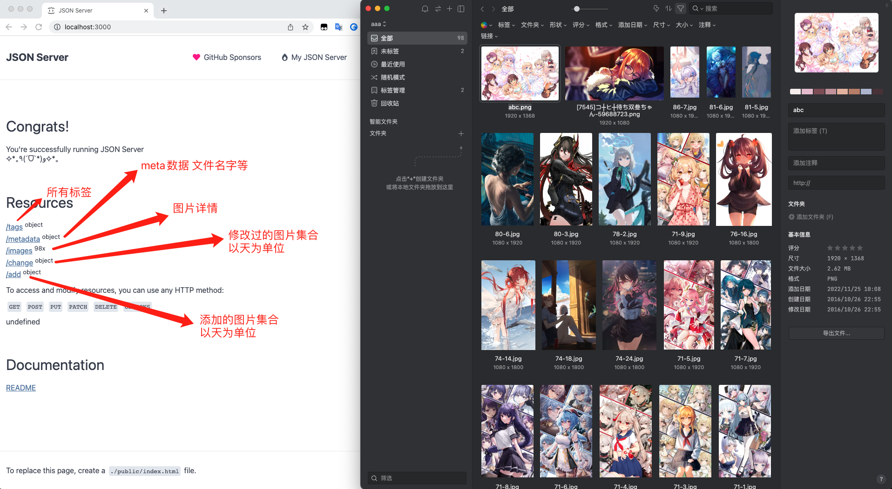
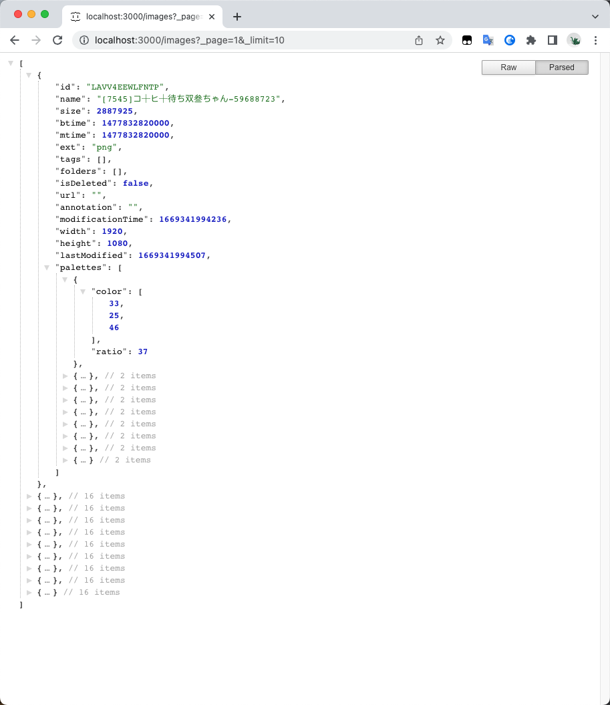
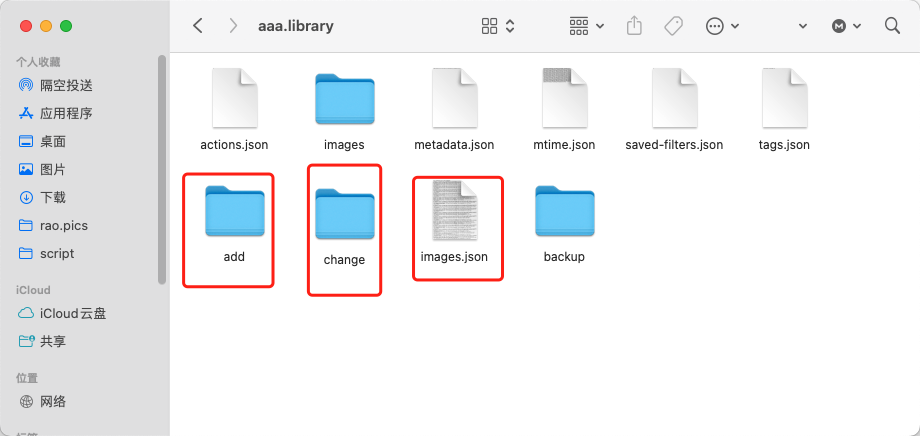
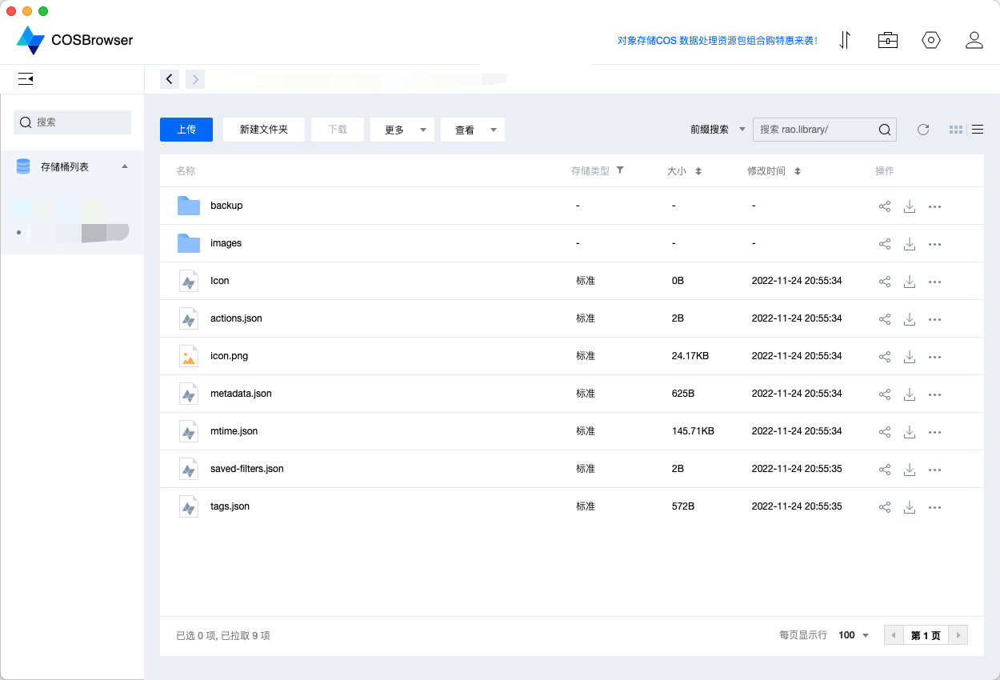
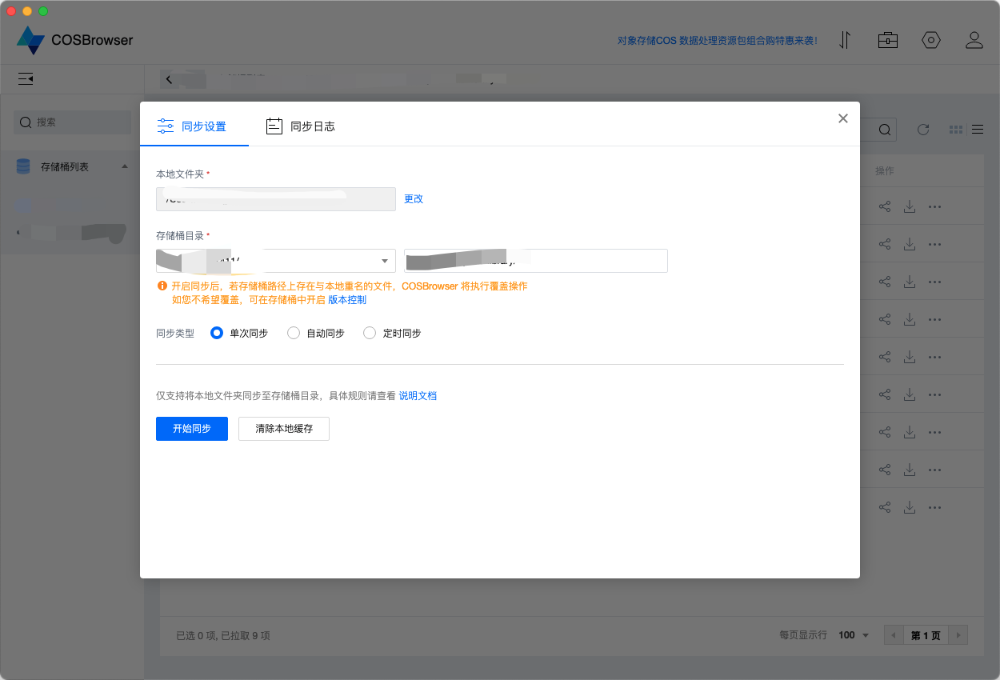

# EagleApi

让你的eagle拥有reset-api能力,基于json-server。

## 介绍

如果你也想把eagle作为一个本地管理系统，每次修改文件，都能动态更新路由，你可以试试它。



**数据分页展示**



**图片库中新增的文件**



## 安装

``` sh
git clone https://github.com/meetqy/eagle-api
cd eagle-api
```

### 配置

将 .env.example 改为 .env

```shell
# eagle library地址 绝对路径
library_dir=xxx.library

# 是否json-server路由展开
is_expand=0

# 端口号
port=3000

# 是否将json中的value转换为字符串
is_value_to_json=0
```

### 启动

```
npm i 
npm start
```


## 待实现功能

- [ ] 关联本地静态文件，可访问图片

## 奇淫技巧

利用腾讯对象存储官方工具，自动同步图片库，在用json-server托管远程文件轻松实现将eagle在线化。




> 难点：json-server远程不支持监听文件改动，暂无解决方案，如果有想法的小伙伴欢迎一起沟通

## 链接

* [Eagle](https://cn.eagle.cool/)
